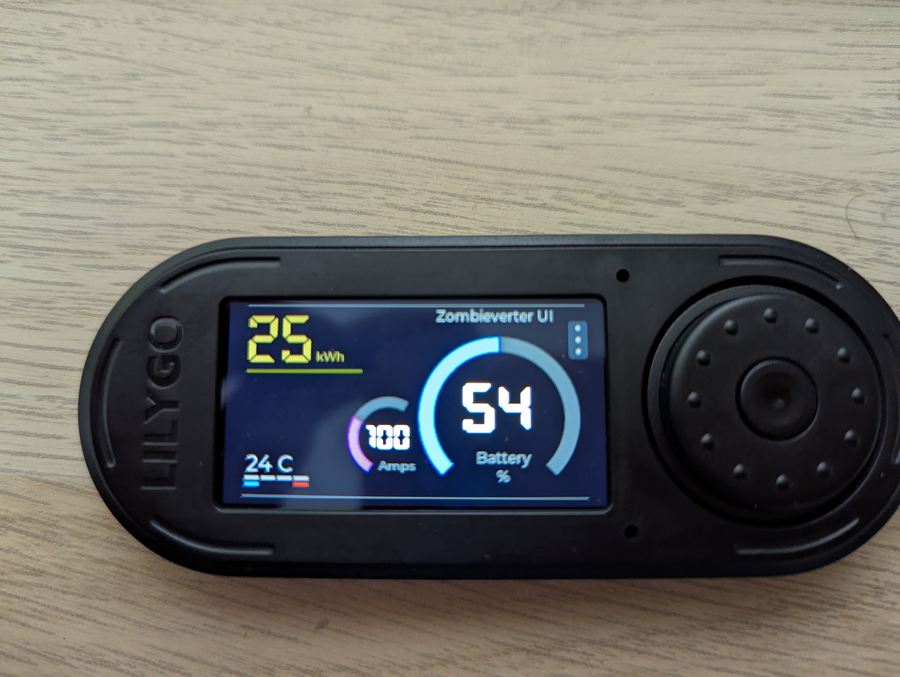

# ZombieVerterDisplay

This project aims to provide an in car display for use with the open source ZombieVerterVCU (https://evbmw.com/index.php/evbmw-webshop/vcu-boards/zombie-vcu) 
commonly used for electric vehicle conversion projects.

It will allow basic parameter changes and display of information using CanSDO to communicate with the VCU. It's designed to run on a Lilygo T-Embed (https://lilygo.cc/products/t-embed?_pos=1&_sid=08a673edb&_ss=r).
This board lacks the required Can Bus transceiver and power supply for the 12-15v from a vehicle. This can be either powered by the USB C port and a Can Bus board connected to the headers on the Lillygo,
alternatively I'm working on a PCB with the power supply and Can Bus transceiver.

UI created in Squireline Studio

## Libraries required
- lvgl@8.3.9
- TFT_eSPI@2.5.23
- SPI@2.0.0
- FS@2.0.0
- SPIFFS@2.0.0
- OneButton@2.0.4
- RotaryEncoder@1.5.2
