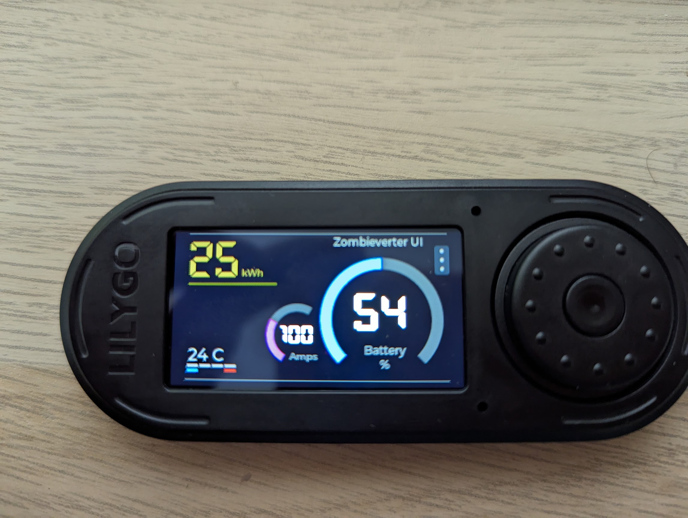

# ZombieVerterDisplay


This project aims to provide an in car display for use with the open source ZombieVerterVCU (https://evbmw.com/index.php/evbmw-webshop/vcu-boards/zombie-vcu)
commonly used for electric vehicle conversion projects.

It will allow basic parameter changes and display of information using CanSDO to communicate with the VCU. It's designed to run on a Lilygo T-Embed (https://lilygo.cc/products/t-embed?_pos=1&_sid=08a673edb&_ss=r).
This board lacks the required Can Bus transceiver and power supply for the 12-15v from a vehicle. This can be either powered by the USB C port and a Can Bus board connected to the headers on the Lillygo,
alternatively I'm working on a PCB with the power supply and Can Bus transceiver.

UI created in Squireline Studio

## Web Flasher - Easy Installation

**One-Click Install:** Flash your Lilygo T-Embed directly from your browser — no development tools needed!

Visit: **https://jamiejones85.github.io/ZombieVerterDisplay**

Requirements:
- Chrome or Edge browser (Web Serial API required)
- USB-C cable that supports data transfer
- Lilygo T-Embed with CAN transceiver

The process takes approximately 30-60 seconds and installs both firmware and web interface files.

## Libraries required
- lvgl@8.3.9
- TFT_eSPI@2.5.43 (or latest 2.5.x)
- SPI@2.0.0
- FS@2.0.0
- SPIFFS@2.0.0
- OneButton@2.0.4
- RotaryEncoder@1.5.2
- ArduinoJson
- AsyncTCP
- ESP Async WebServer
- ElegantOTA

## Setting up GitHub Pages Deployment

To enable the web flasher on your repository:

### 1. Enable GitHub Pages

1. Go to your repository on GitHub: https://github.com/jamiejones85/ZombieVerterDisplay
2. Click **Settings** → **Pages** (in the left sidebar)
3. Under **Build and deployment**, set **Source** to **GitHub Actions**
4. Click **Save**

### 2. Trigger the Build

The workflow will automatically run when you:
- Push to the `main` branch
- Create a new tag (e.g., `v1.2.0`)
- Manually trigger it from the **Actions** tab

### 3. First Time Setup

On the first run:
1. Go to the **Actions** tab in your repository
2. The workflow "Build and Deploy Web Flasher" will start automatically
3. Wait 2-3 minutes for the build and deployment to complete
4. Your web flasher will be live at: https://jamiejones85.github.io/ZombieVerterDisplay

### 4. Verify Deployment

After the workflow completes:
- Visit https://jamiejones85.github.io/ZombieVerterDisplay
- You should see the web flasher interface
- Connect your T-Embed and click "Click to Install ZombieVerter Display"

### Manual Build Process (Optional)

If you prefer to build manually or want to create the merged firmware locally:

```bash
# Install dependencies
arduino-cli core install esp32:esp32
arduino-cli lib install "lvgl@8.3.9" "TFT_eSPI@2.5.43" "OneButton@2.0.4" "RotaryEncoder@1.5.2" "ArduinoJson" "AsyncTCP" "ESP Async WebServer" "ElegantOTA"

# Compile
arduino-cli compile --fqbn esp32:esp32:esp32s3 --output-dir ./build --export-binaries ZombieVerterDisplay.ino

# Create merged binary (requires esptool)
pip install esptool
python -m esptool --chip esp32s3 merge_bin \
  -o firmware.bin \
  --flash_mode dio \
  --flash_freq 80m \
  --flash_size 8MB \
  0x0000 bootloader.bin \
  0x8000 partitions.bin \
  0xe000 boot_app0.bin \
  0x10000 ZombieVerterDisplay.ino.bin \
  0x290000 ZombieVerterDisplay.spiffs.bin
```

The merged `firmware.bin` can then be placed in the `web-flasher/` directory.
